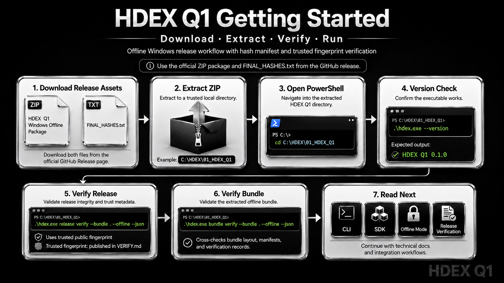

# Contributing to HDEX Q1

Thank you for your interest in improving the HDEX Q1 public release mirror.

This repository is maintained as the official public release mirror for HDEX Q1. It contains public release documentation, verification instructions, release metadata, license material, visual documentation, and official release references.

HDEX Q1 is distributed as free-to-use proprietary software. The proprietary runtime source code, internal build system, signing material, private tests, and development repository are not included in this public mirror.

## 1. Contribution Scope

Accepted contributions are limited to public-facing repository improvements.

Suitable contributions include:

- README improvements
- Verification instruction improvements
- Release note clarity improvements
- Documentation corrections
- Typo and grammar fixes
- Broken link reports
- Public asset naming corrections
- Public release metadata corrections
- Windows setup clarification
- PowerShell command clarification
- Security reporting process improvements
- Accessibility improvements for public images, captions, and alt text
- Issue template improvements
- Public repository organization improvements

Contributions must stay aligned with HDEX Q1 as a controlled, signed, offline Windows release for reproducible and auditable local execution workflows.

## 2. Out-of-Scope Contributions

This repository does not accept contributions for:

- Proprietary HDEX Q1 runtime source code
- Private implementation internals
- Internal build automation
- Signing keys
- Private keys
- Passphrases
- Credentials
- Internal test infrastructure
- Undisclosed security exploit details
- Unauthorized mirrors
- Modified HDEX Q1 binaries
- Repackaged HDEX Q1 releases
- Fake or unofficial HDEX Q1 builds
- License-bypass mechanisms
- Reverse-engineering material
- Tampering instructions
- Runtime patching instructions
- Unverified third-party download links

Do not submit any content that attempts to bypass HDEX Q1 release verification, signature checks, policy controls, licensing restrictions, or official distribution controls.

## 3. Before Opening an Issue

Before opening an issue, review:

- `README.md`
- `VERIFY.md`
- `LICENSE.md`
- The latest GitHub Release
- The official HDEX Systems website
- Existing open and closed issues

Use the issue template that best matches your report:

- Verification failure
- Release asset issue
- Documentation issue
- Windows setup issue
- Security review
- Good first issue

Do not open duplicate issues. If a similar issue already exists, add useful non-sensitive details there instead.

## 4. Security Reporting Rules

Do not disclose active vulnerabilities, exploit details, private keys, passwords, tokens, secrets, confidential files, regulated data, customer data, or sensitive internal material in public GitHub issues, discussions, pull requests, or comments.

For security-related concerns, first review the HDEX Systems security guidance:

```text
https://hdex-systems.web.app/security
````

Public security-review issues may be used only for:

* Security documentation clarity
* Responsible disclosure process improvements
* Verification guidance improvements
* Public hardening recommendations
* Non-sensitive security process concerns

Do not post proof-of-exploit instructions publicly.

## 5. Verification-Related Reports

If reporting a verification failure, include only non-sensitive information.

Recommended details:

* HDEX Q1 version
* ZIP filename
* FINAL_HASHES filename
* Download source
* Windows version
* PowerShell version
* Command used
* Non-sensitive output
* Whether the failure occurred during hash check, release verification, bundle verification, or fingerprint validation

If verification fails, do not run the executable.

## 6. Pull Request Requirements

Pull requests should be small, focused, and easy to review.

Each pull request should explain:

* What changed
* Why the change is needed
* Which file or page is affected
* Whether the change affects release verification instructions
* Whether the change affects public release metadata
* Whether the change affects user-facing security wording

A pull request should not combine unrelated changes. For example, do not combine README edits, release metadata edits, and license wording changes in one large pull request unless they are part of the same correction.

## 7. Documentation Standards

Documentation changes must be:

* Clear
* Accurate
* Minimal
* Consistent with HDEX Q1 terminology
* Safe for public readers
* Free from exaggerated claims
* Free from unsupported security claims
* Easy to follow on Windows
* Careful with command examples
* Consistent with the official release files

Use the following product name consistently:

```text
HDEX Q1
```

Use the following organization/site name consistently:

```text
HDEX Systems
```

Use the official website URL:

```text
https://hdex-systems.web.app/
```

Use the current release version consistently unless the release is formally updated:

```text
HDEX Q1 v0.1.0
```

## 8. Command and Code Block Standards

PowerShell examples must be formatted with fenced code blocks:

```powershell
.\hdex.exe --version
```

Expected plain-text output should be formatted as:

```text
HDEX Q1 0.1.0
```

JSON output examples should be formatted as:

```json
"status": "verified"
```

Do not include secrets, local private paths containing personal information, private usernames, tokens, or internal system details in command examples.

## 9. Release Asset Standards

Release asset references must be exact and consistent.

Current official release assets:

```text
HDEX_Q1_0.1.0_Windows_Offline_Production_Assisted.zip
HDEX_Q1_0.1.0_FINAL_HASHES.txt
```

If a contribution changes release asset wording, it must not imply that unofficial archives, automatic GitHub source archives, or third-party files are official HDEX Q1 runtime packages.

The GitHub-generated `Source code (zip)` and `Source code (tar.gz)` archives are automatic repository snapshots. They are not the proprietary HDEX Q1 runtime source code and are not the official Windows offline package.

## 10. Image and Asset Standards

Public images should be stored under:

```text
assets/
```

Image filenames should be lowercase and hyphen-separated.

Recommended examples:

```text
assets/hdex-q1-mind-map.png
assets/hdex-q1-getting-started.png
```

Images added to the README must include useful alt text.

Example:

```md
<p align="center">
  
</p>
```

Do not add logos, badges, or visual claims that are not supported by the release documentation.

## 11. Labels

Use labels accurately.

Recommended label meanings:

* `verification`: hash, signature, release, bundle, or trusted fingerprint verification issues
* `documentation`: README, VERIFY, release notes, website text, setup, or public docs fixes
* `release-assets`: ZIP, FINAL_HASHES, release attachments, filenames, or release metadata issues
* `good-first-issue`: small beginner-friendly public tasks like typos, links, or README clarity
* `security-review`: security review, responsible disclosure, verification, or hardening concerns
* `windows`: Windows, PowerShell, executable, ZIP extraction, or Windows x64 issues

Do not use `good-first-issue` for tasks requiring proprietary runtime source code.

## 12. Commit Message Guidance

Use short, clear commit messages.

Recommended examples:

```text
Improve README verification instructions
Clarify FINAL_HASHES download guidance
Fix Windows PowerShell setup wording
Add release asset issue template
Update HDEX Q1 getting started image
```

Avoid vague messages such as:

```text
Update files
Fix stuff
Changes
```

## 13. Quality Checklist

Before submitting a pull request, confirm:

* [ ] The change is public-facing and within repository scope.
* [ ] No proprietary source code is included.
* [ ] No private keys, passwords, tokens, or secrets are included.
* [ ] No confidential or regulated data is included.
* [ ] Commands are accurate and safely formatted.
* [ ] Release asset filenames are correct.
* [ ] HDEX Q1 version references are consistent.
* [ ] Links are valid.
* [ ] Markdown renders correctly.
* [ ] Images have useful alt text.
* [ ] The change does not weaken verification, security, or license clarity.

## 14. License and Contribution Terms

By submitting an issue, pull request, documentation change, or public repository improvement, you confirm that you have the right to submit it and that it does not contain confidential, restricted, or third-party proprietary material that you are not authorized to contribute.

Accepted contributions may be incorporated into the HDEX Q1 public release mirror under the repository’s published license terms.

HDEX Q1 remains proprietary software. A contribution to public documentation or repository metadata does not grant access to private source code, internal systems, signing infrastructure, private keys, or unpublished release material.

## 15. Maintainer Rights

Maintainers may close, edit, reject, or remove contributions that:

* Are outside the repository scope
* Contain sensitive information
* Weaken release verification clarity
* Conflict with the HDEX Q1 license
* Promote unofficial builds or mirrors
* Include unsupported claims
* Create legal, security, or operational risk
* Are abusive, spammy, misleading, or unsafe

Maintainers may also edit titles, labels, formatting, and wording for clarity and consistency.

## 16. Project Position

HDEX Q1 is intended to provide a controlled public release path for a signed Windows offline package, release hashes, verification guidance, documentation, SDK materials, and auditable local workflow references.

The contribution process exists to improve public clarity, verification safety, release documentation, and user trust without exposing proprietary implementation material.
