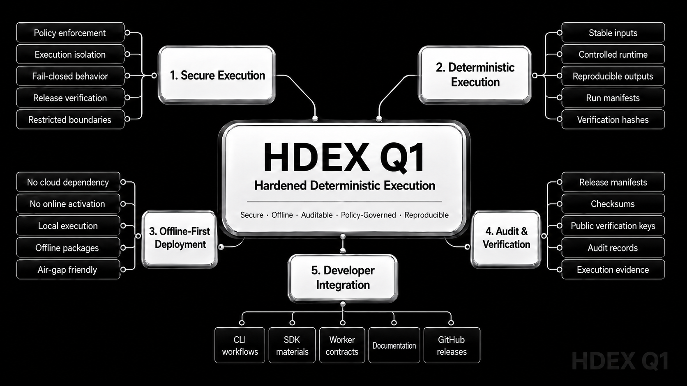

# HDEX Q1

<p align="center">
  
</p>

<p align="center">
  <em>HDEX Q1 is designed around secure, deterministic, offline-first execution with audit-friendly verification and developer-focused integration.</em>
</p>

Official HDEX Q1 public release mirror.

HDEX Q1 is a free-to-use proprietary Windows offline release for controlled, reproducible, and auditable local execution workflows.

## Release

Current release:

- Product: HDEX Q1
- Version: v0.1.0
- Platform: Windows x64
- Package type: Offline ZIP
- Signing profile: Production-assisted
- Signature algorithm: Ed25519
- Signature format: Detached raw Ed25519 PEM signature

## Download

Use the official GitHub Release assets:

- `HDEX_Q1_0.1.0_Windows_Offline_Production_Assisted.zip`
- `HDEX_Q1_0.1.0_FINAL_HASHES.txt`

## Trusted Public Key Fingerprint

```text
634e5b1771b549e9f64f5e5b079b3754fde4b47bd687dbbf8ecc837e6e7072f5
```

## Final ZIP SHA256

```text
27fe306d86e6b0c06da50e2c1a78bfa78db3cd1d7f9572db0c243a71257c5bf6
```

## hdex.exe SHA256

```text
1addd31bbe4d676ad4b91bb4aa28657dbd4d7a095004e7bd176a852e9c628679
```

## Verify After Download

1. Download the ZIP and final hashes file from the GitHub Release.
2. Extract the ZIP.
3. Open PowerShell inside the extracted `01_HDEX_Q1` folder.
4. Run:

```powershell
.\hdex.exe --version
```

5. Verify release signature:

```powershell
.\hdex.exe release verify `
  --bundle . `
  --trusted-key-fingerprint 634e5b1771b549e9f64f5e5b079b3754fde4b47bd687dbbf8ecc837e6e7072f5 `
  --offline `
  --json
```

6. Verify bundle integrity:

```powershell
.\hdex.exe bundle verify `
  --bundle . `
  --trusted-key-fingerprint 634e5b1771b549e9f64f5e5b079b3754fde4b47bd687dbbf8ecc837e6e7072f5 `
  --offline `
  --json
```

Expected successful verification output:

```json
"status": "verified"
```

If verification fails, do not run the executable.

## License

HDEX Q1 is distributed as free-to-use proprietary software.

Source code is not included.

Modification, reverse engineering, repackaging, resale, fake builds, signature tampering, and unauthorized redistribution are restricted by the HDEX Q1 license.

See `LICENSE`.

## Included in the ZIP

- `hdex.exe`
- HDEX Q1 API Starter
- CLI materials
- local API materials
- Rust SDK
- Python SDK
- Node SDK
- Worker SDK
- schemas
- policies
- documentation
- release manifests
- checksums
- detached signature
- public verification key

## Not Included

- Source code
- Private keys
- Passphrases
- Internal build material
- Development repository

## Official Website

```text
https://hdex.web.app
```
